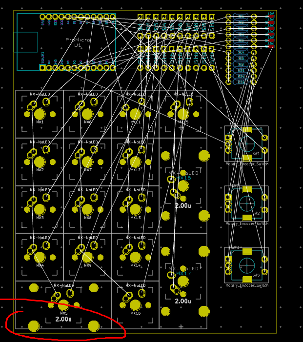
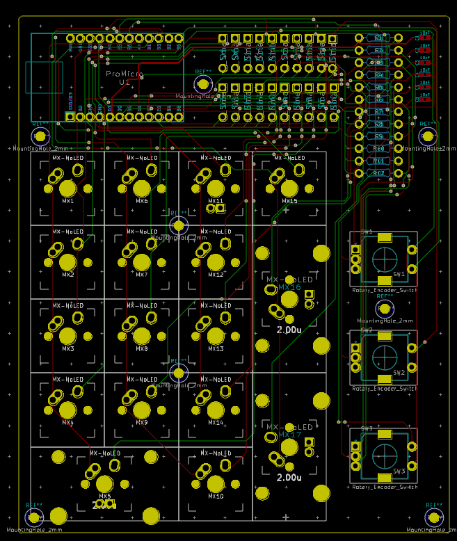
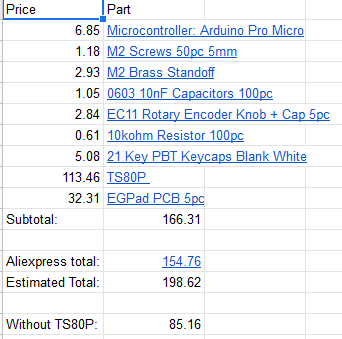
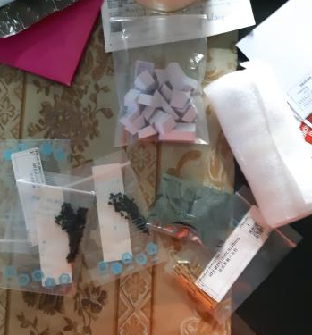
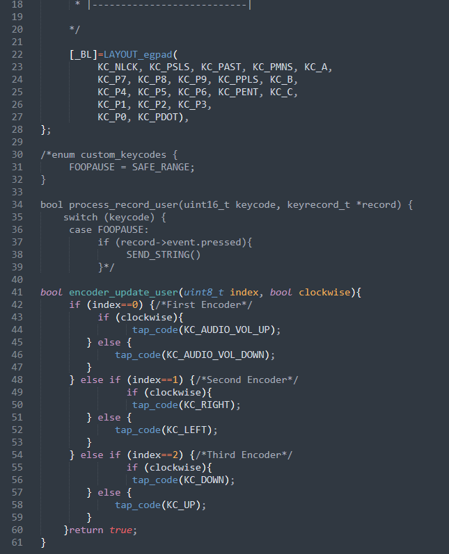

# egpad
walmart discipad with rotary encoders i guess

# build log!

# part 1: prep
Some prepwork for this project involved researching various PCB CAD software that I could use to design my PCB. Eventually, I decided on using KiCAD to design the pcb, thanks to [ai03's PCB Designer Guide](https://wiki.ai03.com/books/pcb-design "ai03's PCB Designer Guide") and [ruiqimao's Keyboard PCB Guide](https://github.com/ruiqimao/keyboard-pcb-guide "ruiqimao's keyboard pcb guide"). The footprint libraries used in this project also came from those guides. I also opted to use the Arduino Pro Micro microcontroller to power the board as its quite popular for DIY boards and its QMK compatible.

# part 2: schematic design
Next, I had to learn how to use KiCAD, which mostly came from ai03's guide. First, I created the schematic which is the most important part of the design. Overall a pretty easy step, it was similar to the circuit design software Multisim so I had some knowledge going into this. 

One problem that I ran into right off the bat was there wasn't a lot of information on how to implement a rotary encoder (specifically an EC11 encoder), so I had to search quite a while to find anything useful. Luckily, I came across [this comment thread](https://www.keebtalk.com/t/how-to-wire-a-rotary-encoder-fit-in-a-matrix/6330/7) which contained lots of helpful graphics and theory for implementing your own rotary encoder.

Now that I knew how to implement all the components required for the board, I came up with this schematic:  
 

# part 3: PCB design
This part was probably the most time consuming out of the entire project, because I wanted to make sure that it looked exactly how I wanted. For context, I'm basing this board off of the Discipad, which is a design that I really like.  

The PCB design process was relatively straightforward. Since I created the schematic first, all I needed to do was arrange all the components to look proper:  

Now its time to route the traces or essentially wire the components of the PCB together. This is the most time consuming part of the PCB Design process, as it also 
involves a lot of planning as well as trial and error. The top of the board was especially difficult due to the density of the components and lack of space for the traces:  
 

My first attempt at routing the traces for the board was quite messy:  
 

I figured since I now knew how routing traces worked, I could use the Discipad routing to make mine look better:  

A side by side comparison:  

 

Now that I've completed the PCB design, I created some renders to see how the board would look IRL: 

  

# part 4: manufacturing
Now that all aspects of the design have been completed, I started looking for vendors to print the PCB, as well as places to buy the components (caps, resistors, switches etc.). For the PCB, I decided to go with [JLCPCB](https://jlcpcb.com/) since I've heard good things about them and you can print various coloured PCBs (thanks matthew). All the other components I decided to buy from various aliexpress vendors since its cheap and I'm in no real rush to build this thing. I compiled all the costs into an excel sheet for a very primitive bill of materials (BoM) which is also included in this repo: 
 
I decided to skip the TS80 and just borrow my friend's setup (thanks matthew).  

At the time, I completely forgot to purchase stabs so rip 2u keys.

Parts came in around 2-4 weeks later:  
 

# part 4.5: assembly
Since I had some prior experience soldering this wasn't too troublesome to complete. The hardest parts were probably the SMD capacitors since they were so small, and the Pro Micro pins since the pins didn't have much support to hold them, I had to get my friend to do most of them for me (thanks matthew):  
 

After a couple hours of soldering, here is the finished build:  

 

# part 5: programming
Now that the physical board has been completed, I began working on writing the firmware for the board. Using the [QMK wiki](https://docs.qmk.fm/#/ "QMK Documentation"), I rewrote the files on an existing board so I wouldn't have to worry to much about formatting and all that: 
 

The firmware is included in this repo if you want to explore it in detail. All files were edited on Sublime Text Editor.  

Throughout the process, I had to flash the firmware to make sure it worked as I added more functions. This was done through QMK MSYS and QMK Toolbox.

Finally, the finished product:

https://user-images.githubusercontent.com/69698200/134389948-083b9ff9-627d-4abd-a4a4-c04e07a00819.mp4

# afterword
This has been a very fun project from start to finish, I highly recommend anyone reading this to try creating your own board from scratch, theres a lot you can learn from this project alone. Overall I'd consider this a success, might need a longer cable though. Thanks tanman for helping me throughout the entire project <3.
