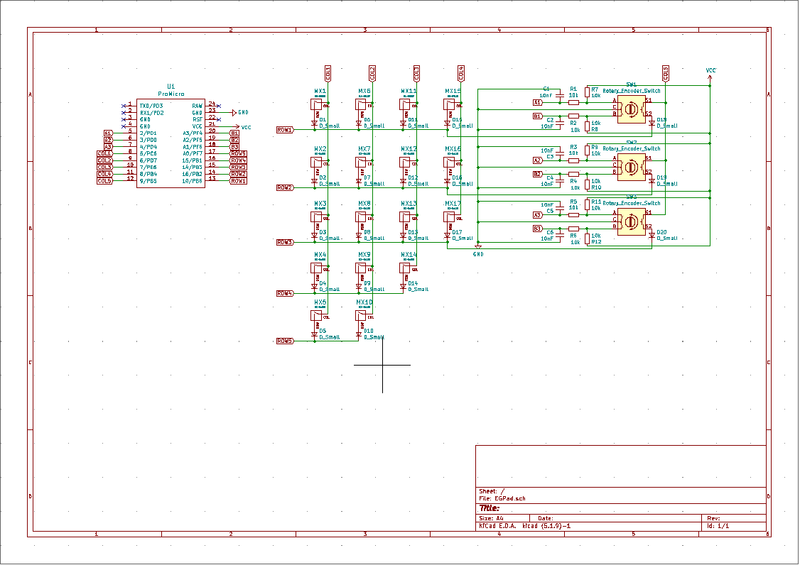
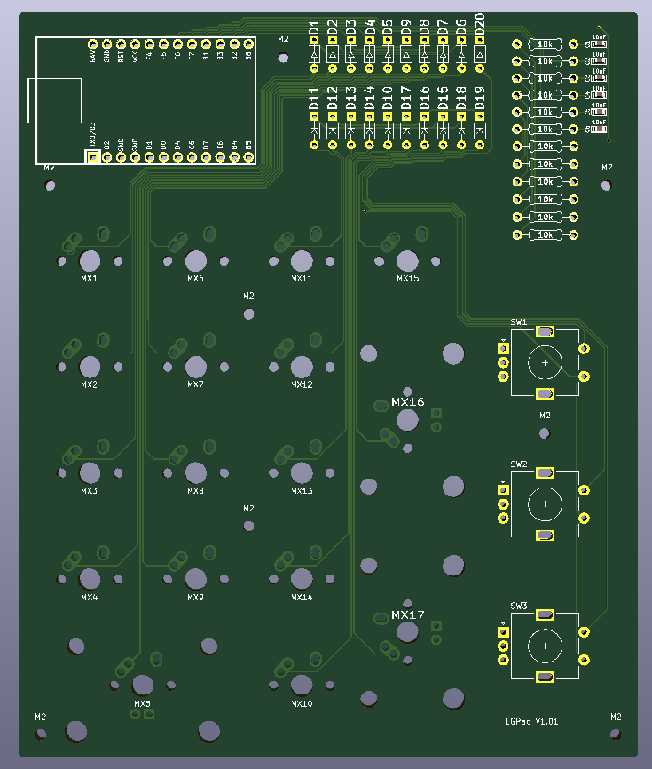
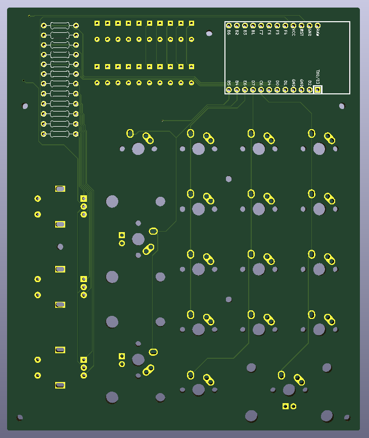
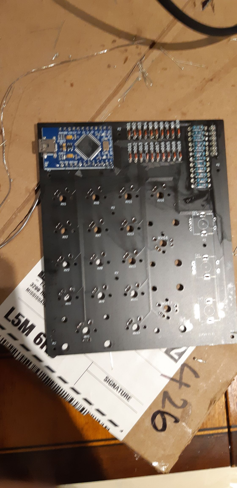
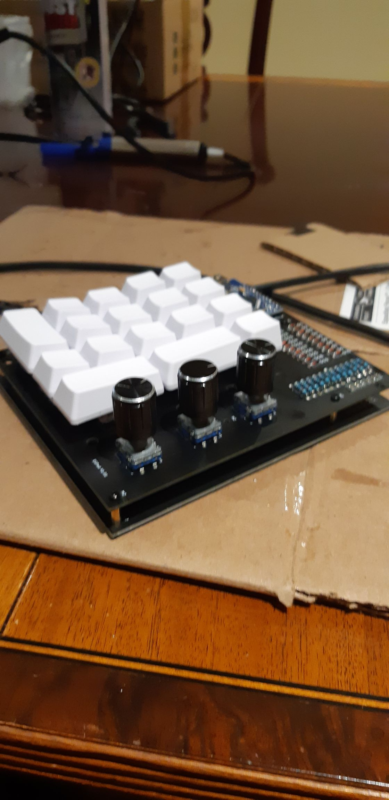
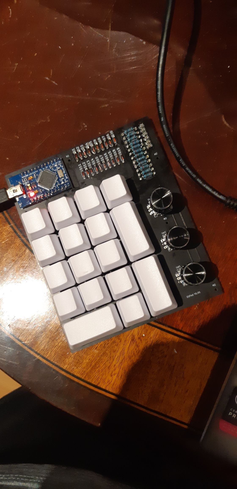

# egpad
walmart discipad with rotary encoders i guess

# build log!

# part 1: prep
Some prepwork for this project involved researching various PCB CAD software that I could use to design my PCB. Eventually, I decided on using KiCAD to design the pcb, thanks to [ai03's PCB Designer Guide](https://wiki.ai03.com/books/pcb-design "ai03's PCB Designer Guide") and [ruiqimao's Keyboard PCB Guide](https://github.com/ruiqimao/keyboard-pcb-guide "ruiqimao's keyboard pcb guide"). The footprint libraries used in this project also came from those guides.

# part 2: schematic design
Next, I had to learn how to use KiCAD, which mostly came from ai03's guide. First, I created the schematic which is the most important part of the design. Overall a pretty easy step, it was similar to the circuit design software Multisim so I had some knowledge going into this. 

One problem that I ran into right off the bat was there wasn't a lot of information on how to implement a rotary encoder (specifically an EC11 encoder), so I had to search quite a while to find anything useful. Luckily, I came across [this comment thread](https://www.keebtalk.com/t/how-to-wire-a-rotary-encoder-fit-in-a-matrix/6330/7) which contained lots of helpful graphics and theory for implementing your own rotary encoder.

Now that I knew how to implement all the components required for the board, I came up with this schematic:
 

# part 3: PCB design
This part was probably the most time consuming out of the entire project, because I wanted to make sure that it looked exactly how I wanted. For context, I'm basing this board off of the Discipad, which is a design that I really like.  

The PCB design process was relatively straightforward. Since I created the schematic first, all I needed to do was arrange all the components to look proper.

Overall I'd consider this a success, might need a longer cable though.
